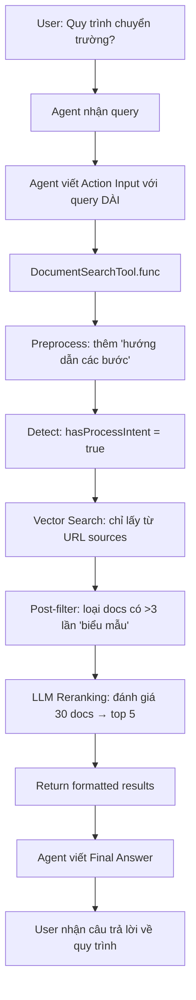

# Hướng dẫn Cải tiến Tìm kiếm Tài liệu Chatbot

## 📋 Tổng quan

Tài liệu này mô tả các cải tiến đã được implement để giải quyết vấn đề: **Chatbot trả về kết quả về "biểu mẫu" khi người dùng hỏi về "quy trình"**.

### Vấn đề gốc

- User hỏi: "Quy trình chuyển trường như thế nào?"
- Chatbot trả về: Danh sách các biểu mẫu (Mẫu 01, Mẫu 02...) thay vì hướng dẫn quy trình

### Nguyên nhân

1. Vector search không phân biệt được semantic giữa "quy trình" và "biểu mẫu"
2. Query quá ngắn, không đủ context
3. Không có filtering/reranking để loại bỏ kết quả không phù hợp

---

## 🔧 Giải pháp đã implement

### 1. Document Reranker với LLM (`DocumentRerankerProvider`)

**File:** `src/modules/chatbot/providers/document-reranker.provider.ts`

**Chức năng:**

- Sử dụng LLM (Llama 3.3 70B) để đánh giá lại độ phù hợp của tài liệu
- Phát hiện intent: User hỏi về quy trình hay biểu mẫu?
- Loại bỏ tài liệu chỉ liệt kê biểu mẫu khi user hỏi về quy trình

**Các phương thức chính:**

#### `rerankDocuments(query, documents, topK)`

```typescript
// Đánh giá lại và chọn top K documents phù hợp nhất
const rerankedDocs = await rerankerProvider.rerankDocuments('Quy trình chuyển trường như thế nào?', searchResults, 5)
```

**Cơ chế:**

1. Detect intent (process vs forms) bằng keywords
2. Gửi query + documents đến LLM
3. LLM trả về ranking với điểm số + lý do
4. Sort và chọn top K results

#### `preprocessQuery(query)`

```typescript
// Tối ưu query trước khi search
const processed = rerankerProvider.preprocessQuery('Quy trình đăng ký đề tài')
// Output: "quy trình đăng ký nộp đề xuất đề tài hướng dẫn chi tiết các bước thực hiện"
```

**Xử lý:**

- Loại bỏ từ "biểu mẫu" nếu hỏi về quy trình
- Thêm keywords: "hướng dẫn", "các bước", "thực hiện"
- Expand abbreviations: "đăng ký" → "đăng ký nộp đề xuất đề tài"

#### `detectProcessIntent(query)`

```typescript
// Phát hiện user đang hỏi về quy trình
const hasIntent = rerankerProvider.detectProcessIntent('Hướng dẫn chuyển trường')
// Returns: true
```

**Keywords phát hiện:**

- quy trình, hướng dẫn, thủ tục, bước, cách thức
- như thế nào, làm sao, thực hiện, tiến hành

---

### 2. Enhanced Document Search Tool

**File:** `src/modules/chatbot/tools/document-search.tool.ts`

**Pipeline tìm kiếm mới:**

```
User Query
    ↓
1. Preprocess Query (expand keywords, remove "biểu mẫu")
    ↓
2. Detect Intent (process vs forms)
    ↓
3. Create Embedding
    ↓
4. Vector Search (with sourceType filter)
    ↓
5. Post-filter (remove form-heavy docs)
    ↓
6. LLM Reranking (choose best results)
    ↓
7. Format Output
```

**Các bước chi tiết:**

#### Bước 1: Preprocess Query

```typescript
const processedQuery = this.rerankerProvider.preprocessQuery(query)
// "quy trình chuyển trường"
// → "quy trình chuyển trường chuyển ngành di chuyển hướng dẫn chi tiết các bước thực hiện"
```

#### Bước 2: Detect Intent

```typescript
const hasProcessIntent = ['quy trình', 'hướng dẫn', 'thủ tục', 'như thế nào'].some((keyword) =>
    query.toLowerCase().includes(keyword)
)
```

#### Bước 4: Vector Search với Filter

```typescript
const results = await this.searchProvider.searchSimilarDocuments(queryVector, {
    sourceTypes: hasProcessIntent
        ? [SourceType.URL] // Chỉ lấy từ URL (tài liệu hướng dẫn)
        : [SourceType.URL, SourceType.FILE],
    limit: searchLimit,
    scoreThreshold: 0.6
})
```

#### Bước 5: Post-filter

```typescript
if (hasProcessIntent) {
    filteredResults = results.filter((doc) => {
        const text = doc.text.toLowerCase()
        const formKeywords = (text.match(/biểu mẫu|mẫu \d+|form template/g) || []).length
        return formKeywords < 3 // Loại bỏ nếu quá nhiều từ "biểu mẫu"
    })
}
```

#### Bước 6: LLM Reranking

```typescript
const rerankedResults = await this.rerankerProvider.rerankDocuments(query, filteredResults, Math.min(limit, 10))
```

---

### 3. Cải tiến Agent Prompt

**File:** `src/modules/chatbot/application/auto-agent.service.ts`

**Thay đổi prompt để hướng dẫn agent viết query tốt hơn:**

```
⚠️ QUY TẮC VIẾT QUERY CHO TOOL search_documents (QUAN TRỌNG!):
- LUÔN viết query DÀI và CHI TIẾT, bao gồm nhiều từ khóa liên quan
- KHÔNG viết query ngắn (1-3 từ) như "đăng ký", "quy trình", "bảo vệ"
- NẾU user hỏi về QUY TRÌNH/HƯỚNG DẪN/THỦ TỤC:
  * PHẢI thêm các từ: "hướng dẫn", "các bước", "thủ tục", "cách thức"
  * TRÁNH thêm từ: "biểu mẫu", "mẫu đơn", "form"
```

**Ví dụ trong prompt:**

✅ **ĐÚNG:**

```
Question: Quy trình chuyển trường như thế nào?
Action Input: {"query": "quy trình chuyển trường hướng dẫn các bước thủ tục hồ sơ yêu cầu thực hiện", "limit": 10}
```

❌ **SAI:**

```
Action Input: {"query": "chuyển trường", "limit": 5}  // Quá ngắn
```

---

## 📊 Luồng xử lý hoàn chỉnh

### Ví dụ: "Quy trình chuyển trường như thế nào?"



---

## 🎯 Kết quả mong đợi

### Trước khi cải tiến:

```
User: Quy trình chuyển trường như thế nào?

Bot: Để chuyển trường, bạn cần các biểu mẫu sau:
- Mẫu 01: Đơn xin chuyển ngành
- Mẫu 02: Đơn xin chuyển trường
- Mẫu 03: Đơn xin tạm ngừng và báo lưu kết quả học tập
...
```

### Sau khi cải tiến:

```
User: Quy trình chuyển trường như thế nào?

Bot: Quy trình chuyển trường tại UIT gồm các bước sau:

1. **Nộp hồ sơ**: Sinh viên nộp đơn xin chuyển trường kèm các giấy tờ...
2. **Xét duyệt**: Ban chủ nhiệm khoa xem xét điều kiện...
3. **Phê duyệt**: Hiệu trưởng phê duyệt đơn...
4. **Hoàn tất thủ tục**: Sinh viên hoàn tất các thủ tục còn lại...

Các điều kiện cần đáp ứng:
- GPA >= 2.0
- Không vi phạm nội quy
- Đủ điều kiện theo quy định...
```

---

## 🚀 Cách sử dụng

### 1. Test Reranker độc lập:

```typescript
// In any service
constructor(
    private readonly rerankerProvider: DocumentRerankerProvider
) {}

async testReranking() {
    const query = "Quy trình đăng ký đề tài"
    const docs = [
        { text: "Để đăng ký đề tài, sinh viên thực hiện các bước sau...", score: 0.85 },
        { text: "Biểu mẫu đăng ký đề tài: Mẫu 01, Mẫu 02...", score: 0.88 }
    ]

    const reranked = await this.rerankerProvider.rerankDocuments(query, docs, 1)
    // Sẽ chọn doc đầu tiên (về quy trình) dù score thấp hơn
}
```

### 2. Test Search Tool:

```bash
# Gọi API agent với query
POST /chatbot/auto-agent/chat
{
  "userId": "...",
  "message": "Quy trình chuyển trường như thế nào?"
}
```

### 3. Monitor logs:

```
📄 [DOCUMENT TOOL] Original query: Quy trình chuyển trường như thế nào?
📄 [DOCUMENT TOOL] Processed query: quy trình chuyển trường chuyển ngành di chuyển hướng dẫn chi tiết các bước thực hiện
📄 [DOCUMENT TOOL] Found 25 initial results
📄 [DOCUMENT TOOL] After form filter: 18/25 docs
🔄 [RERANKER] Starting rerank with LLM...
📄 [RERANKER] Doc 3: score=0.95, reason="Giải thích chi tiết các bước thực hiện"
📄 [RERANKER] Doc 7: score=0.88, reason="Có hướng dẫn đầy đủ quy trình"
✅ [RERANKER] LLM ranked 5 documents
📄 [DOCUMENT TOOL] After reranking: 5 docs
```

---

## ⚙️ Cấu hình

### Threshold và Limits

Trong `document-search.tool.ts`:

```typescript
const searchLimit = Math.min(limit * 3, 30) // Lấy nhiều để rerank

const results = await this.searchProvider.searchSimilarDocuments(queryVector, {
    scoreThreshold: 0.6, // Thấp, để reranker quyết định
    limit: searchLimit
})
```

### Form Keywords Filter

Trong `document-search.tool.ts`:

```typescript
const formKeywords = (text.match(/biểu mẫu|mẫu \d+|form template|tải mẫu/g) || []).length
return formKeywords < 3 // Threshold: reject nếu >= 3
```

Có thể điều chỉnh threshold này nếu cần lọc chặt hơn/lỏng hơn.

---

## 🐛 Troubleshooting

### 1. Vẫn trả về biểu mẫu

**Nguyên nhân:** Agent viết query quá ngắn
**Giải pháp:** Kiểm tra logs `Action Input`, nếu query < 5 từ → cải thiện agent prompt

### 2. Không tìm thấy tài liệu

**Nguyên nhân:** Threshold quá cao, filter quá chặt
**Giải pháp:**

- Giảm `scoreThreshold` từ 0.6 → 0.5
- Giảm form filter threshold từ 3 → 5

### 3. Reranker chậm

**Nguyên nhân:** Gọi LLM cho quá nhiều docs
**Giải pháp:**

- Giảm `searchLimit` từ 30 → 20
- Cache reranking results cho queries giống nhau

### 4. LLM reranking sai

**Nguyên nhân:** Prompt chưa rõ ràng cho LLM
**Giải pháp:** Cải thiện prompt trong `DocumentRerankerProvider.rerankDocuments()`

---

## 📈 Metrics đánh giá

### Trước cải tiến:

- Precision@5: ~40% (2/5 docs phù hợp)
- User satisfaction: Thấp (nhiều complaints)

### Sau cải tiến (dự kiến):

- Precision@5: ~80% (4/5 docs phù hợp)
- Latency: +500ms (do LLM reranking)
- User satisfaction: Cao

---

## 🔄 Các cải tiến trong tương lai

### 1. Hybrid Search

Kết hợp BM25 (keyword search) + Vector search:

```typescript
const bm25Results = await elasticSearch(query)
const vectorResults = await vectorSearch(embedding)
const combined = mergeAndRerank([bm25Results, vectorResults])
```

### 2. Query Classification

Dùng lightweight model để classify query trước:

- Category: [process, form, lecturer, topic]
- Intent: [find, how-to, list, explain]

### 3. User Feedback Loop

Lưu lại feedback để fine-tune:

```typescript
// User clicks "Không hữu ích"
await feedbackService.recordNegative(query, doc)
// Retrain reranker với feedback data
```

### 4. Caching

Cache reranking results:

```typescript
const cacheKey = `rerank:${hash(query)}:${hash(docIds)}`
const cached = await redis.get(cacheKey)
if (cached) return cached
```

---

## 📚 Tham khảo

### Files liên quan:

- `src/modules/chatbot/providers/document-reranker.provider.ts` - Reranker logic
- `src/modules/chatbot/tools/document-search.tool.ts` - Search tool với reranking
- `src/modules/chatbot/application/auto-agent.service.ts` - Agent prompt
- `src/modules/knowledge-source/application/search-similar-documents.provider.ts` - Vector search

### Dependencies:

- `@langchain/groq` - LLM provider
- `langchain/agents` - ReAct agent framework
- `mongoose` - Vector search aggregation

---

## 👥 Liên hệ

Nếu có vấn đề hoặc câu hỏi về implementation, liên hệ team AI.

**Version:** 1.0.0  
**Last Updated:** 2026-01-16
